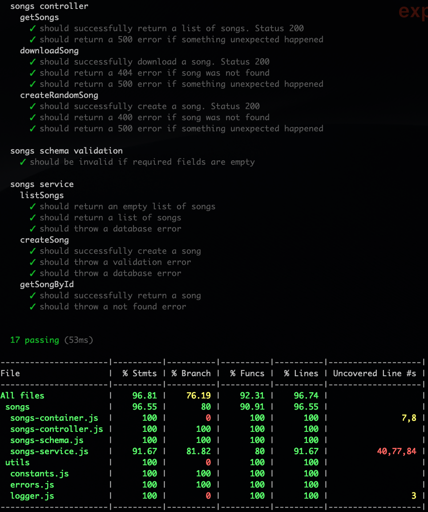

Songs Express
=============

## Pre-requisites

You should have this installed on your system:

- Node.js >= 8.2
- MongoDB >= 3.4

In the root folder, create a `.env` file with the following variables:

        DB_HOST=mongodb://localhost:27017
        DB_NAME=songs

Or rename `.env.sample` to `.env`

Make sure the `.env` values match the MongoDB config of your system

## Preparing the data

If you want to get data from the available endpoints you should manually insert some songs in MongoDB. See the file [lib/songs/songs-schema.js](lib/songs/songs-schema.js) to know what's the sb schema for a song.

Also, to test the download endpoint, set the location to an existing file on your system, relative to the `uploads`folder located at the root of the project. For example, for a song like this:
    
    {
        _id: "5d799b655d68a63e7418a78e",
        title: "song",
        artist: "artist",
        genre: "genre",
        length: 250,
        location: "song.mp3"
    }

you should locate a file named `song.mp3` in [`./uploads/song.mp3`](./uploads/song.mp3)

## Running the app

Run

    - npm i
    - npm run start

Then in your browser open this: `http://localhost:3000/v1/songs`

Also, you can run any http endpoint by using VSCode [REST Client](https://marketplace.visualstudio.com/items?itemName=humao.rest-client). Just open the file [`docs/example-requests.http`](docs/example-requests.http)

## Running the tests

Run

    npm run test

Tests run in isolation and do not depend on a external database

## Available endpoints

### **List songs**

- **URL**: `/v1/songs`
- **Example URL**: [http://localhost:3000/v1/songs?skip=0&limit=3&title=let](http://localhost:3000/v1/songs?skip=0&limit=3&title=let)
- **Method**: `GET`
- **Query Params**:
  - `title`=[alphanumeric] : The title of the song
  - `skip`=[numeric] : Pagination parameter. Skips the given number in the result
  - `limit`=[numeric] : Pagination parameter. Limits the number of documents returned
- **Sucess Response** : 
  - Code: `200 OK`
  - Example: 
  
        [
            {
                "_id":"5d799b655d68a63e7418a78e",
                "title":"Let her go 1",
                "artist":"Passenger",
                "genre":"Pop",
                "length":253,
                "location":"let-her-go-passenger.mp3",
                "created":"2019-09-12T01:12:05.781Z",
                "__v":0
            },
            ...
        ]
- **Error Response** : 
  - Code: `500 Internal Server Error` unexpected error

### **Download songs**

- **URL**: `/v1/songs/:id/download`
- **Example URL**: [http://localhost:3000/v1/songs/5d799b821cfc8b4238c9a17d/download](http://localhost:3000/v1/songs/5d799b821cfc8b4238c9a17d/download)
- **Method**: `GET`
- **URL Params**:
  - `id`=[alphanumeric] : The id of the song
- **Sucess Response** : 
  - Code: `200 OK`
- **Error Response** : 
  - Code: `404 Not found` when the song was not found
  - Code: `500 Internal Server Error` unexpected error

## How to improve

- Add logging
- Add e2e tests for the API
- Store the files in the cloud (S3 or G. Cloud Storage)